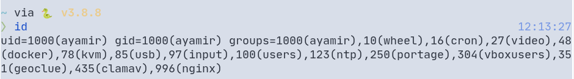
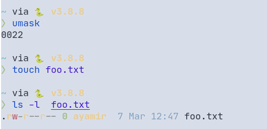

# Table of Contents

1.  [文件和目录的权限](#org60ae53e)
2.  [id：显示用户身份标识](#org93017c6)
3.  [chmod：更改文件模式](#org3ced07b)
4.  [umask：设置文件默认权限](#org6a7856d)
5.  [su：以另一个用户身份运行 shell](#org4dd1fc3)
6.  [sudo：以另一个用户身份执行命令](#org3d97889)
7.  [chown：更改文件所有者](#orgf870caa)
8.  [chgrp：更改文件所属群组](#orgcb5c39d)
9.  [passwd：更改用户密码](#orgec58e7c)

# 文件和目录的权限

权限属性：

# id：显示用户身份标识

一个用户可以拥有文件和目录，同时对其拥有的文件和目录有控制权
用户之上是群组，一个群组可以由多个用户组成
文件和目录的访问权限由其所有者授予群组或者用户

uid 和 gid 分别说明了当前用户的用户编号与用户名、所属用户组的编号与组名
groups 后的内容说明了用户还属于哪些组，说明了其对应的编号和名称

许多类 UNIX 系统会将普通用户分配到一个公共的群组中如：users
现代 Linux 操作是创建一个独一无二的只有一个用户的同名群组

# chmod：更改文件模式

chmod 支持两种标识方法

1.  八进制表示法

    <table border="2" cellspacing="0" cellpadding="6" rules="groups" frame="hsides">

    <colgroup>
    <col  class="org-right" />

    <col  class="org-right" />

    <col  class="org-left" />
    </colgroup>
    <tbody>
    <tr>
    <td class="org-right">八进制</td>
    <td class="org-right">二进制</td>
    <td class="org-left">文件模式</td>
    </tr>

    <tr>
    <td class="org-right">0</td>
    <td class="org-right">000</td>
    <td class="org-left">---</td>
    </tr>

    <tr>
    <td class="org-right">1</td>
    <td class="org-right">001</td>
    <td class="org-left">&#x2013;x</td>
    </tr>

    <tr>
    <td class="org-right">2</td>
    <td class="org-right">010</td>
    <td class="org-left">-w-</td>
    </tr>

    <tr>
    <td class="org-right">3</td>
    <td class="org-right">011</td>
    <td class="org-left">-wx</td>
    </tr>

    <tr>
    <td class="org-right">4</td>
    <td class="org-right">100</td>
    <td class="org-left">r--</td>
    </tr>

    <tr>
    <td class="org-right">5</td>
    <td class="org-right">101</td>
    <td class="org-left">r-x</td>
    </tr>

    <tr>
    <td class="org-right">6</td>
    <td class="org-right">110</td>
    <td class="org-left">rw-</td>
    </tr>

    <tr>
    <td class="org-right">7</td>
    <td class="org-right">111</td>
    <td class="org-left">rwx</td>
    </tr>
    </tbody>
    </table>

    常用的模式有 7,6,5,4,0
2.  符号表示法

    <table border="2" cellspacing="0" cellpadding="6" rules="groups" frame="hsides">

    <colgroup>
    <col  class="org-left" />

    <col  class="org-left" />
    </colgroup>
    <tbody>
    <tr>
    <td class="org-left">符号</td>
    <td class="org-left">含义</td>
    </tr>

    <tr>
    <td class="org-left">u</td>
    <td class="org-left">user：表示文件或目录的所有者</td>
    </tr>

    <tr>
    <td class="org-left">g</td>
    <td class="org-left">group：文件所属群组</td>
    </tr>

    <tr>
    <td class="org-left">o</td>
    <td class="org-left">others：表示其他用户</td>
    </tr>

    <tr>
    <td class="org-left">a</td>
    <td class="org-left">all：u+g+o</td>
    </tr>
    </tbody>
    </table>

    如果没有指定字符默认使用 all
    &rsquo;+&rsquo;表示添加一种权限
    &rsquo;-&rsquo;表示删除一种权限
    例如：

    <table border="2" cellspacing="0" cellpadding="6" rules="groups" frame="hsides">

    <colgroup>
    <col  class="org-left" />

    <col  class="org-left" />
    </colgroup>
    <tbody>
    <tr>
    <td class="org-left">符号</td>
    <td class="org-left">含义</td>
    </tr>

    <tr>
    <td class="org-left">u+x</td>
    <td class="org-left">所有者+可执行</td>
    </tr>

    <tr>
    <td class="org-left">u-x</td>
    <td class="org-left">所有者-可执行</td>
    </tr>

    <tr>
    <td class="org-left">+x</td>
    <td class="org-left">所有用户+可执行</td>
    </tr>

    <tr>
    <td class="org-left">o-rw</td>
    <td class="org-left">其他用户-读写</td>
    </tr>

    <tr>
    <td class="org-left">go=rw</td>
    <td class="org-left">群组用户和其他用户权限更改为读，写</td>
    </tr>

    <tr>
    <td class="org-left">u+x,go=rx</td>
    <td class="org-left">所有者+可执行，群组用户和其他用户权限更改为读，可执行</td>
    </tr>
    </tbody>
    </table>

    &rsquo;-R&rsquo;=&rsquo;&#x2013;recursive&rsquo;表示递归设置

# umask：设置文件默认权限

使用八进制表示法表示从文件模式属性中删除一个位掩码
掩码的意思：用掩码来取消不同的文件模式

    umask

可以看到输出为：

    0022

不同 linux 发行版默认的文件权限不同，这里的输出是 gentoo linux 上普通用户对应的的输出
0022：先不看第一个 0,后面的 0|2|2 用二进制展开结果是：000|010|010

<table border="2" cellspacing="0" cellpadding="6" rules="groups" frame="hsides">

<colgroup>
<col  class="org-left" />

<col  class="org-left" />

<col  class="org-left" />

<col  class="org-left" />

<col  class="org-left" />
</colgroup>
<tbody>
<tr>
<td class="org-left">原始文件模式</td>
<td class="org-left">---</td>
<td class="org-left">rw-</td>
<td class="org-left">rw-</td>
<td class="org-left">rw-</td>
</tr>

<tr>
<td class="org-left">掩码</td>
<td class="org-left">000</td>
<td class="org-left">000</td>
<td class="org-left">000</td>
<td class="org-left">010</td>
</tr>

<tr>
<td class="org-left">结果</td>
<td class="org-left">---</td>
<td class="org-left">rw-</td>
<td class="org-left">rw-</td>
<td class="org-left">r--</td>
</tr>
</tbody>
</table>

掩码中 1 对应位处的权限会被取消，0则不受影响
所以会有这样的结果：

再来谈最前面的 0:因为除了 rwx 之外还有较少用到的权限设置

1.  setuid 位:4000(8 进制)
    设置此位到一个可执行文件时，有效用户 ID 将从实际运行此程序的用户 ID 变成该程序拥有者的 ID
    设置场景：应用于由 root 用户拥有的程序，当普通用户运行一个具有 setuid 位的程序时，这个程序会以超级用户的权限执行，因此可以访问普通用户无法访问到的文件和目录
    设置程序 setuid：

        chmod u+s program_name

    结果：

        -rwsr-xr-x

    可以看到第二组权限中第一个符号是 s
2.  setgid 位:2000(8 进制)
    有效组 ID 从该用户的实际组 ID 更改为该文件所有者的组 ID
    设置场景：当一个公共组下的成员需要访问共享目录下的所有文件时可以设置此位
    对一个目录设置 setgid 位，则该目录下新创建的文件将由该目录所在组所有

        chmod g+s dir_name

    结果：

        drwxrwsr-x

    可以看到第二组权限中最后一个符号是 s(替换了 x)
3.  sticky 位:1000(8 进制)
    标记一个可执行文件是“不可交换的”，linux 中默认会忽略文件的 sticky 位，但是对目录设置 sticky 位，能阻止用户删除或者重命名文件，除非用户是这个目录的所有者，文件所有者或者 root
    用来控制对共享目录的访问

        chmod +t dir_name

    结果：

        drwxrwxrwt

    可以看到第三组权限中最后一个符号是 t(替换了 x)

# su：以另一个用户身份运行 shell

# sudo：以另一个用户身份执行命令

# chown：更改文件所有者

# chgrp：更改文件所属群组

# passwd：更改用户密码

